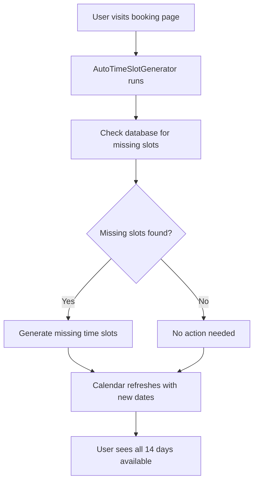

# Automatic Time Slot Generation Solution

## Problem
The booking system shows a rolling 14-day calendar, but time slots are not automatically created for new dates. When tomorrow comes, the new date (day 15) entering the window will appear disabled if no time slots exist in the database.

## Solution Implemented ✅

### 1. AutoTimeSlotGenerator Component
- **Location**: `src/components/AutoTimeSlotGenerator.tsx`
- **Purpose**: Automatically ensures time slots exist for the entire 14-day rolling window
- **When it runs**: Every time the booking page loads
- **What it does**: Calls the `generateTimeSlots` function to create any missing slots

### 2. Enhanced generateTimeSlots Function
- **Location**: `src/lib/supabase.ts`
- **Fallback mechanism**: If database function doesn't exist, manually creates slots
- **Smart insertion**: Uses `ON CONFLICT DO NOTHING` to avoid duplicates

### 3. Real-time Refresh
- **Calendar refresh**: DateCalendar component refreshes when new slots are generated
- **Seamless UX**: Users don't notice the background slot creation

## How It Works



## Manual Backup Options

If you prefer manual management, you can:

### Option 1: Admin Panel Bulk Generation
1. Go to `/admin` panel  
2. Use "Bulk Time Slot Generation" feature
3. Set date range to extend into the future

### Option 2: Database Cron Job (Advanced)
Create a PostgreSQL cron job to run daily:

```sql
-- This would run daily at midnight to create slots for new dates
SELECT cron.schedule('create-timeslots', '0 0 * * *', 'SELECT generate_timeslots_for_date(CURRENT_DATE + 14);');
```

### Option 3: External Scheduler
Use services like:
- Vercel Cron Jobs
- GitHub Actions
- External cron services

## Benefits of Current Solution

✅ **Automatic**: No manual intervention required  
✅ **Reliable**: Runs every page load  
✅ **Fast**: Only creates missing slots  
✅ **Safe**: Won't create duplicates  
✅ **Fallback**: Works even without database functions  

## Testing

To test the automatic generation:

1. Delete future time slots from database
2. Visit booking page  
3. Check that all 14 days show as available
4. Verify new slots were created in database

## Future Enhancements

Potential improvements:
- Add configurable business hours per day
- Support different time slots for weekends
- Add holiday scheduling exceptions
- Create admin setting to enable/disable auto-generation
